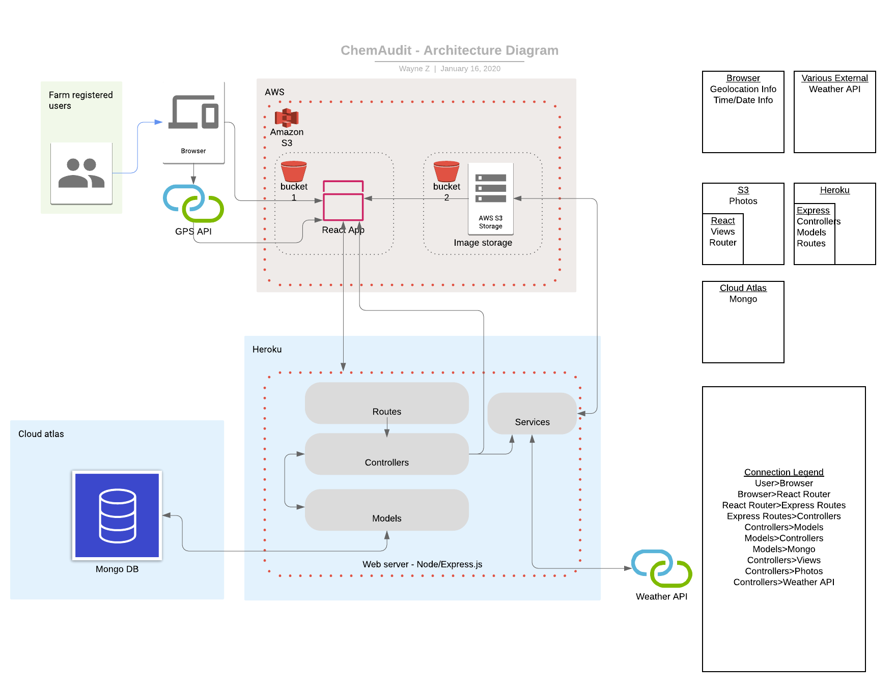
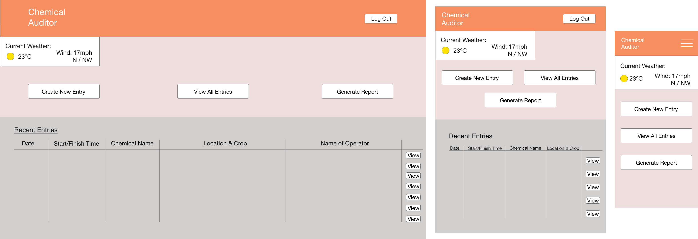
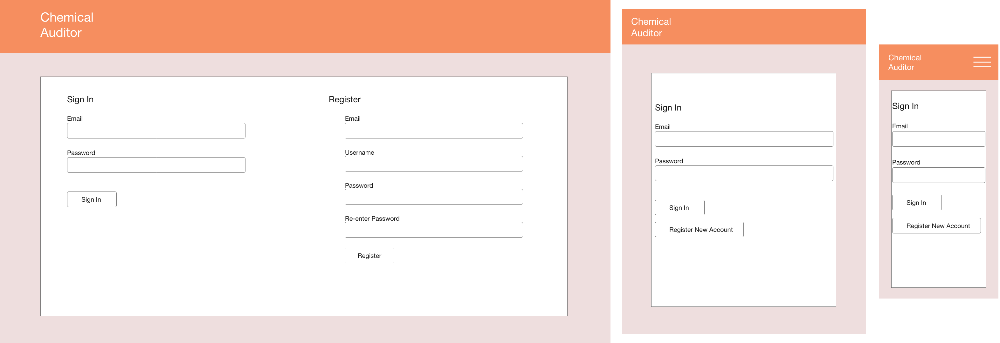
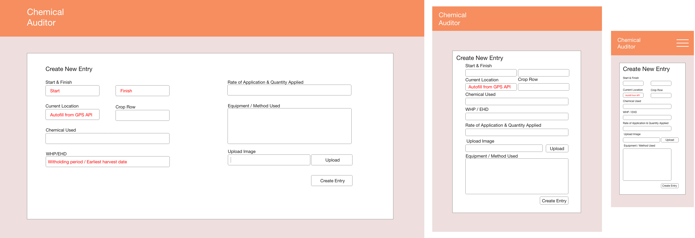
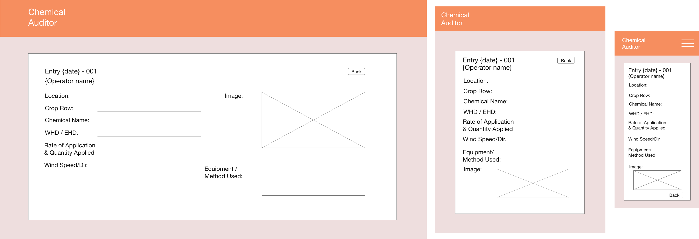

# Chemical Auditor Documentation

## Website Description

Client: SSS Strawberries
Address: Lot 2 Rosedale Road Oakwood QLD 4670
Contact Name: Ijan Kruizinga

### Purpose

Due to the use of herbicides and pesticides on farms, and the resulting environmental impacts, audit trails are kept to ensure quality assurance requirements for pre-harvest chemical applications. The purpose of our application is to allow chemical-distributing farm workers to easily record all relevant information, moving the farm towards more efficient and environmentally friendly (fully digital) record keeping. The application will also allow the generation of reports for use by farm managers in auditing meetings.

The benefits this application could bring to the farm include a streamlining of the record-keeping process, addition of photographic evidence, as well as increased transparency, efficiency and data security.

### Features

#### User Requirements

- Login system distinguishing regular employee/administrator permissions, utilising email & password.
- Admin accounts with ability to create, edit and delete user accounts, as well as record, edit, delete and export the records/entries.

#### Functional Requirements

- Mobile (Android/IOS) and Tablet interface.
- Offline capabilities/Progressive Web App (Stretch Goal).

#### System Features

- Full CRUD report resources.
- Generate audit log using reports.
- Print/export audit log to PDF / .CSV.
- Take/delete photos of chemicals.
- Add/edit notes on reports.
- Add/edit/delete Farm Locations (bays recorded as letters, A/B/C etc.)
- A record of audit logs must be backed up in event of a system failure.

### Proposed Tech Stack

- AWS - Image upload storage
- Axios - Make promise AJAX requests
- Body-parser - Simplified request bodies
- Celebrate - User input validation
- Climacell - API for weather information
- CORS - Cross origin request support
- Connect-mongo - session data store functionality
- Cron - Automatic monthly reports/'Cron jobs'
- Dotenv - Access .env variables
- Express.js - Back-end server
- Express-session - session storage functionality
- Heroku - Deployment of web server
- Jest - Testing
- JWT - JSON web token functionality
- Lodash - Various general helper methods
- Material UI - Styling framework
- MongoDB - User information & record storage
- MongoDB Atlas - MongoDB cloud hosting
- Mongoose - Create model schemas and query MongoDB
- Mongoose-bcrypt - Encrypt passwords in MongoDB
- Node.js - Javascript environment to run backend
- Nodemon - Live-server monitoring
- Open Weather - API for weather information
- Passport - Authenticate requests
- React - Front-end view rendering & geo-location services
- React-dom - Connects React to the browser DOM
- React-router-dom - Enables React single-page refresh routing
- React-redux - Connect React and Redux
- Redux - Internal data functionality

## Data flow diagram

## Application Architecture Diagram

## User Stories

### As a seasonal worker, I need to easily understand and use the application with little extra training.

- As Hamish the seasonal worker, I need to be able to easily approach and understand the application, ensuring I can fulfil my job roles with little extra training.
- As John the seasonal worker, I would like to have a logical layout with intuitive logos, to enable me to fulfil my role without a complicated use of the English language.

### As a full-time employee, I need to be able to review information quickly and plan my daily work efficiently.

- As full-time employee Garret, I would like to quickly attain weather information from the application to plan my daily work schedule.
- As Garret, I need to have quick access to recent entries to reduce double-handling and ensure my work is completed.
- As full-time employee Rebecca, I would like a more efficient means of creating records than I have at present, cutting down office admin and ensuring accuracy during busy periods.
- As Rebecca, I would like to be able to receive feedback from my managers regarding my record entries.

### As a farm manager, I need to be able to keep track of data entries, and easily generate reports to meet auditing requirements.

- As Vicky the farm manager, I need to be able to easily generate an up-to-date reports as required by auditors.
- As Vicky, I need to be able to view recent entries, and view each individual entries details if required.
- As Vicky, I need to be able to edit reports if data is entered incorrectly.
- As Michael, I need to be able to leave feedback and notes within entries if required.
- ensure sensitive data (trade data) is stored safely & securely
- As Michael, I want to ensure the farms sensitive trade data is stored safely and securely.

### As an auditor, I need reports to be legible, easily understood, and to adhere to the legal requirements of the audit.

- As an auditor, I need to be able to easily read and understand the new format of audit reports, with them following the current design pattern to ensure confusion is minimized.
- As an auditor, I need to be sure all legal requirements are met regarding information integrity.

## Wireframes

### Dashboard

### Login

### New Entry

### View Entry

## Trello board screenshots

